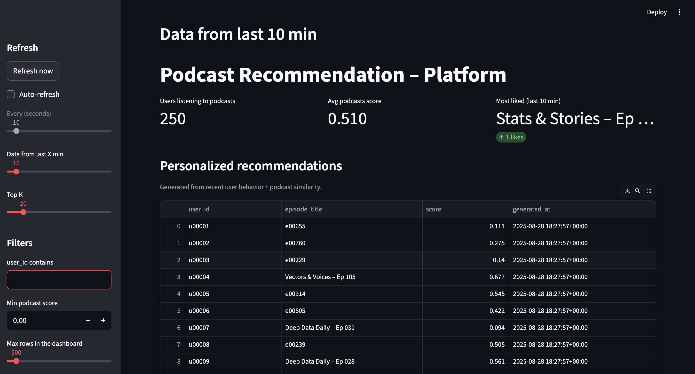

# Podcast Analytics & Recommendation Platform

How can we recommend the right podcast episode to the right user — not just based on what they listened to, but also on what the episode is about?

This project explores hybrid recommendation methods, combining:
- User event signals → clicks, listens, and engagement patterns
- Content similarity → transcript embeddings & text analysis

By merging these two worlds, we aim to provide recommendations that are both personalized (based on history) and serendipitous (discovering new but relevant episodes).

This project builds an end-to-end data pipeline to recommend podcast episodes to users based on their interactions and also podcasts content. The workflow includes:

# Workflow 
- Ingest and store new podcast episodes & transcripts
- Track and simulate user interactions
- Train both collaborative filtering and content-based recommendation models
- Combine their predictions into a hybrid recommendation system
- Serve results through an interactive dashboard

---
# 📂 Project Structure

```bash
root/
├── _delta/                # Delta Lake tables (episodes, events, history)
├── airflow/               # Apache Airflow DAG orchestration configs
│   └── dags/              # DAG definitions (pipelines, scheduling)
├── config/
│   └── settings.py        # Centralized project settings
├── data/                  # Raw & processed datasets (local staging area)
├── docker/                # Docker build files & container configs
├── docs/                  # Documentation, diagrams, and architecture notes
├── scripts/               # Utility scripts (ETL jobs, helpers, maintenance, dashboard)
├── spark/                 # Spark jobs for distributed processing
│   └── pipelines/         # Individual Spark pipeline definitions
├── demo/                  # Example runs, demo workflows, or notebooks
├── .env.development       # Environment variables (local dev)
├── .gitignore             # Ignore rules for Git
├── Makefile               # Developer shortcuts (build, test, run, deploy)
├── requirements.txt       # Python dependencies
└── README.md              # Project documentation 

```
---

## Data Pipeline Overview

| Stage                        | Description                                                                |
|------------------------------|----------------------------------------------------------------------------|
|  Ingestion                   | Download new episodes, fetch transcripts                                   |
|  Transcript Analysis         | NLP-based feature extraction using Spark                                   |
|  User Events Streaming       | Simulation of Real-time interaction data (views, clicks, time spent)       |
|  Model Training              | Collaborative filtering + content-based recommendation models              |
|  Final Recommendation        | Scores and recommends episodes                                             |
|  Dashboard                   | Interactive UI to explore recommendations and model metrics                |

---
##  Technologies

| Tool           | Why It’s Used                                          |
| -------------- | ------------------------------------------------------ |
| **Airflow**    | Orchestrates pipelines (DAG-based scheduling)          |
| **Delta Lake** | Reliable, ACID-compliant storage for streaming + batch |
| **Kafka**      | Handles real-time ingestion of episodes & user events  |
| **Spark**      | Scales transcript + event processing for ML            |
| **Streamlit**  | Lightweight dashboard for demo & visualization         |

---

## Architecture

## Architecture Diagram


### Ingest

* Fetch trending episodes from PodcastIndex.com → publish to Kafka (`episode-metadata`, `episode-ids`)
* Vosk voice-to-text writes **episodes** & **transcripts** to **Delta**
* User Event simulation - in order to recreate real life data (Stream processing)

### Training / Analytics

* Aggregate **user events** (stream/micro-batch) into **Delta**
* Train **user events** via ALS (Spark ML) to get episode recommendation based on user events

* Batch procesing: Loading transcript text data from Delta and training them 
* Traning transcript data - output: text embedings = text similarities, recomputed each time batch is running 


### Serving

* **MongoDB** stores the `final_recommendations` data which combine similarities recommendation + user event recommendation
* **Streamlit** reads **Mongo** (final_recommendation) + **Delta** (user_events “last N minutes”, episodes metadata) via **DuckDB**


---

## Prerequisites

* **Docker Desktop** (with Compose)
* Free local ports for services (Kafka, Mongo, Spark UI, Airflow UI, Streamlit)
* If your network uses a corporate/VPN proxy, ensure Docker can pull from Docker Hub (see **Troubleshooting**)

---
# Getting Started

1. Run **make init** (wait until it finishes).  
   The only container that should be stopped after this command is `airflow-airflow-init-1` (it is only used to initialize Airflow).  

2. Connect to the Airflow interface at `http://localhost:8081`  
   (username: `airflow`, password: `airflow`).  
   Go to **Admin > Connections**, search for `spark_default`, click **Edit parameter**, and change the value in the **host** field to `local[*]`. Save it.  

3. Go to the **DAGs** page, run the demo DAG that initializes the system, and once it has finished, run the recommendation DAG.  

---

### Viewing Results
After these operations, we have simulated the functionality of the system.  
To check the results, go to `http://localhost:8084`.  

## Example Dashboard


